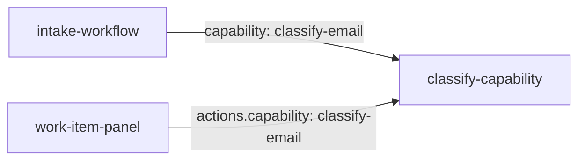

A production bundle combines Extension, Workflow, Knowledge, and Panel manifests with cross-file capability references.

## Directory layout

```
my-extension/
  manifests/
    extension.yaml              # Bundle identity (required for push)
    classify-capability.yaml    # Extension: classify-email
    intake-workflow.yaml        # Workflow: invoice-intake
    customer-records.yaml       # Knowledge: partner/customer
    work-item-panel.yaml        # Panel: work-item-summary
```

## How files reference each other



| Source | Reference | Target |
|--------|-----------|--------|
| `intake-workflow.yaml` step `classify` | `capability: classify-email` | `classify-capability.yaml` |
| `work-item-panel.yaml` actions | `capability: classify-email` | `classify-capability.yaml` |

Knowledge manifests are independent — no cross-file refs to capabilities.

## Bundle identity

The Extension manifest that sets push identity:

```yaml
apiVersion: relynt.com/v1
kind: Extension
metadata:
  name: my-extension
  version: 1.0.0
spec:
  # capability definitions or capabilities[] array
```

`metadata.name` and `metadata.version` on this manifest determine the registry entry for `relynt push`.

## Validate the full bundle

```bash
relynt validate ./manifests
```

Cross-file validation ensures:

- All `capability` references resolve to Extension declarations
- No duplicate `entityType.key` across Knowledge manifests
- All step IDs and `next` references are valid

## Publish and install

```bash
relynt push ./manifests
relynt install my-extension@1.0.0
```

## Related examples

- [Email intake workflow](/extensions/examples/email-intake)
- [Work item panel](/extensions/examples/work-item-panel)
- [Bundle layout](/extensions/platform/bundle-layout)
