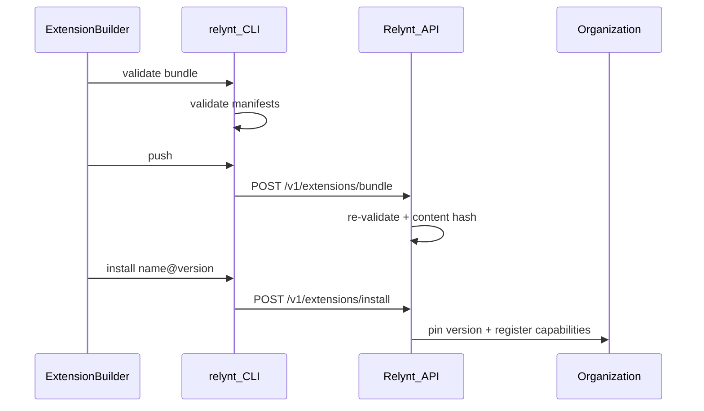

A Relynt **extension** is the integration itself — a published package that connects your systems to the platform. Extensions are built from **declarative manifests** with no server-side code in your bundle. You define capabilities, workflows, knowledge types, and UI panels in YAML; Relynt validates, stores, and executes them at runtime.

## Extension lifecycle



## What's in an extension

An extension bundle contains one or more manifest files. Each file has a Kubernetes-style envelope with a `kind` field:

| Kind | Role in the extension |
|------|-----------------------|
| `Extension` | Declares the extension identity and one or more capabilities with input/output schemas and bindings |
| `Workflow` | Step graph for automation (email intake, work item triggers) |
| `Knowledge` | Entity type definitions and sync mappings |
| `Panel` | Declarative UI components bound with CEL expressions |

The `kind: Extension` manifest sets the extension name and version used when publishing. All other manifests are companions that add workflows, knowledge, and panels to the same integration.

All manifests share `apiVersion: relynt.com/v1` and kebab-case `metadata.name` values.

## Cross-file references

Bundles are validated as a unit. References must resolve within the same bundle:

- Workflow `Capability` steps reference capability names declared in Extension manifests
- Panel `actions[].capability` references the same capability namespace
- Knowledge `sync.mapping` attributes must exist on the declared entity schema

## Immutable versions

Each push creates an **immutable semver version** identified by a content hash:

- Same semver + same content → idempotent (returns existing version)
- Same semver + different content → `409 Conflict`
- New semver → new version appended to the registry

## Org-scoped installs

Publishing registers a version globally. **Installing** pins that version for a specific organization:

- Capabilities become available for workflow builder and panel actions
- Knowledge entity types are registered for sync
- Panels are resolved at runtime for matching work items

Workflow manifests in bundles are stored for reference and diffing but are **not auto-imported** on install.

## Extension connections

Capabilities with `binding.type: endpoint` reference a **connection** by key. Organizations create connections via the API to wire your capability to their webhook endpoint:

```yaml
binding:
  type: endpoint
  connection: classify-email-dev
  body:
    messageId: input.messageId
```

See [Capabilities](/extensions/manifests/extensions) for binding details.

## Related

- [Bundle layout](/extensions/platform/bundle-layout)
- [Lifecycle](/extensions/platform/lifecycle)
- [Versioning](/extensions/platform/versioning)
